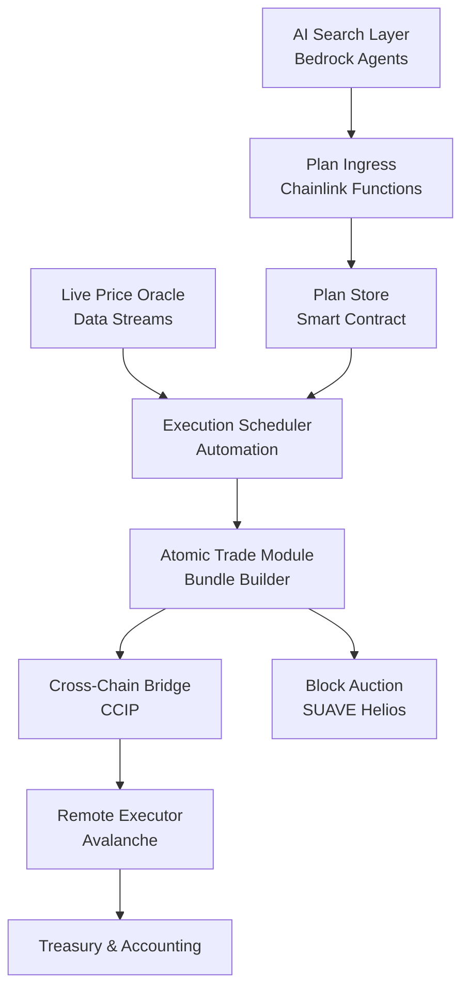

# 🚀 Cross-Domain Arbitrage Bot - MEV Searcher

> **Autonomous MEV searcher** that captures price discrepancies between **Arbitrum** and **Avalanche** networks using **Chainlink CCIP** and **SUAVE Helios** for atomic cross-chain arbitrage.

## 📋 Table of Contents

- [🎯 Project Overview](#-project-overview)
- [🏗️ Architecture](#️-architecture)
- [🛠️ Tech Stack](#️-tech-stack)
- [⚡ Quick Start](#-quick-start)
- [📁 Project Structure](#-project-structure)
- [🔧 Configuration](#-configuration)
- [🚀 Deployment](#-deployment)
- [📊 Monitoring](#-monitoring)
- [🧪 Testing](#-testing)
- [📚 Documentation](#-documentation)
- [👥 Team Tasks](#-team-tasks)

## 🎯 Project Overview

The Cross-Domain Arbitrage Bot is an **autonomous MEV searcher** that executes atomic arbitrage transactions across Arbitrum and Avalanche networks. The system:

1. **Detects** profitable price discrepancies between DEXs on both networks
2. **Executes** atomic swap sequences using Chainlink CCIP for cross-chain messaging
3. **Ensures** fail-safe execution through SUAVE Helios bundling
4. **Maximizes** profit while minimizing risk through AI-powered decision making

### Key Features

- ✅ **Atomic Cross-Chain Execution** - All or nothing transaction guarantees
- ✅ **AI-Powered Decision Making** - Amazon Bedrock agents for intelligent routing
- ✅ **Real-time Price Monitoring** - Chainlink Data Streams integration
- ✅ **Automated Execution** - Chainlink Automation for trigger management
- ✅ **Risk Management** - Built-in gas and slippage protection
- ✅ **MEV Protection** - SUAVE Helios for transaction privacy

## 🏗️ Architecture

The system consists of 8 core components working together:



## 🛠️ Tech Stack

| Component | Technology | Purpose |
|-----------|------------|---------|
| **Smart Contracts** | Solidity 0.8.x + Foundry | On-chain execution logic |
| **AI Agents** | Python 3.x + Amazon Bedrock | Intelligent arbitrage detection |
| **Cross-Chain** | Chainlink CCIP | Token and message bridging |
| **Automation** | Chainlink Functions + Automation | Trigger management |
| **Oracles** | Chainlink Data Streams | Real-time price feeds |
| **MEV Protection** | SUAVE Helios | Transaction bundling |
| **Monitoring** | Python + FastAPI | Dashboard and alerts |
| **Infrastructure** | Docker + AWS | Deployment and hosting |

## ⚡ Quick Start

### Prerequisites

- Node.js 18+ and npm
- Python 3.9+
- Foundry (for Solidity development)
- Docker and Docker Compose
- AWS CLI (for Bedrock access)

### 1. Clone and Setup

```bash
git clone https://github.com/your-org/chainlink-arbitrage-bot.git
cd chainlink-arbitrage-bot

# Install dependencies
npm install
pip install -r requirements.txt

# Setup environment
cp .env.example .env
# Edit .env with your configuration
```

### 2. Install Foundry Dependencies

```bash
cd contracts
forge install
cd ..
```

### 3. Start Development Environment

```bash
docker-compose up -d
```

### 4. Deploy Smart Contracts (Testnet)

```bash
make deploy-testnet
```

### 5. Start the Bot

```bash
# Start AI agents
python -m agents.main

# Start monitoring dashboard
python -m monitoring.dashboard.app
```

## 📁 Project Structure

```
chainlink-arbitrage-bot/
├── contracts/          # Solidity smart contracts
├── agents/            # Amazon Bedrock AI agents
├── chainlink/         # Chainlink integrations
├── suave/            # SUAVE Helios integration
├── monitoring/       # Dashboard and metrics
├── scripts/          # Deployment scripts
├── tests/            # Integration tests
├── docs/             # Documentation
├── config/           # Configuration files
└── tools/            # Development tools
```

## 🔧 Configuration

### Environment Variables

Copy `.env.example` to `.env` and configure:

```bash
# Blockchain Networks
ARBITRUM_RPC_URL=https://arb1.arbitrum.io/rpc
AVALANCHE_RPC_URL=https://api.avax.network/ext/bc/C/rpc
PRIVATE_KEY=your_private_key_here

# Chainlink Configuration
CHAINLINK_FUNCTIONS_SUBSCRIPTION_ID=123
CHAINLINK_AUTOMATION_UPKEEP_ID=456

# AWS Bedrock
AWS_REGION=us-east-1
AWS_ACCESS_KEY_ID=your_access_key
AWS_SECRET_ACCESS_KEY=your_secret_key

# SUAVE Configuration
SUAVE_KETTLE_RPC=https://rpc.rigil.suave.flashbots.net
SUAVE_PRIVATE_KEY=your_suave_private_key

# Monitoring
DASHBOARD_PORT=8080
METRICS_PORT=9090
```

### Chain Configuration

Edit `config/chains.json` to configure supported DEXs and tokens:

```json
{
  "arbitrum": {
    "chainId": 42161,
    "dexes": ["sushiswap", "uniswap_v3"],
    "tokens": ["WETH", "USDC", "USDT"]
  },
  "avalanche": {
    "chainId": 43114,
    "dexes": ["trader_joe", "pangolin"],
    "tokens": ["WAVAX", "USDC", "USDT"]
  }
}
```

## 🚀 Deployment

### Testnet Deployment

```bash
# Deploy all contracts to testnets
make deploy-testnet

# Setup Chainlink services
make setup-chainlink-testnet

# Deploy Bedrock agents
make deploy-agents-testnet
```

### Mainnet Deployment

```bash
# Deploy contracts to mainnet (requires verification)
make deploy-mainnet

# Setup production monitoring
make setup-monitoring-prod

# Deploy to AWS
make deploy-aws-prod
```

## 📊 Monitoring

### Dashboard

Access the monitoring dashboard at `http://localhost:8080` to view:

- 📈 Live price spreads
- 💰 Realized profits
- ⚡ Gas prices
- 🔄 Active arbitrage plans
- 📊 Success/failure rates

### CLI Tools

```bash
# Check system status
python -m monitoring.cli.status

# View profit history
python -m monitoring.cli.profits --days 7

# Monitor gas prices
python tools/gas_tracker.py
```

## 🧪 Testing

### Smart Contract Tests

```bash
cd contracts
forge test
```

### Integration Tests

```bash
# Run full integration test suite
pytest tests/

# Run specific test categories
pytest tests/test_agents.py
pytest tests/test_chainlink.py
```

### End-to-End Tests

```bash
# Run E2E tests on testnet
python tests/test_e2e.py --network testnet
```

## 📚 Documentation

- [📖 Implementation Guide](docs/IMPLEMENTATION.md) - Detailed implementation instructions
- [🏛️ Architecture Overview](docs/ARCHITECTURE.md) - System architecture deep dive
- [🔌 API Documentation](docs/API.md) - API reference
- [🚀 Deployment Guide](docs/DEPLOYMENT.md) - Production deployment
- [🔧 Troubleshooting](docs/TROUBLESHOOTING.md) - Common issues and solutions

## 👥 Team Tasks

This project is designed for a **4-developer team**. See [Team Task Division](docs/TEAM_TASKS.md) for detailed task assignments:

- **👨‍💻 Developer 1**: Smart Contracts & Foundry
- **🤖 Developer 2**: AI Agents & Bedrock Integration  
- **🔗 Developer 3**: Chainlink Services & CCIP
- **📊 Developer 4**: SUAVE Integration & Monitoring

## 🤝 Contributing

1. Fork the repository
2. Create a feature branch (`git checkout -b feature/amazing-feature`)
3. Commit your changes (`git commit -m 'Add amazing feature'`)
4. Push to the branch (`git push origin feature/amazing-feature`)
5. Open a Pull Request

## 📄 License

This project is licensed under the MIT License - see the [LICENSE](LICENSE) file for details.

## ⚠️ Disclaimer

This software is for educational and research purposes. Trading cryptocurrencies involves substantial risk. Always test thoroughly on testnets before mainnet deployment.

---

**🔥 Ready to capture MEV opportunities? Let's build the future of cross-chain arbitrage!**

