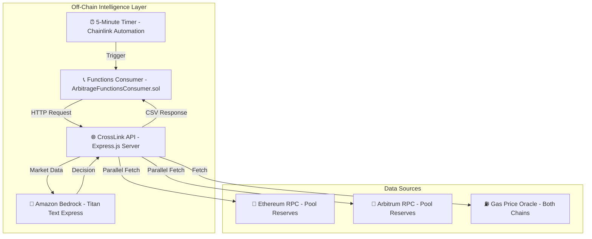
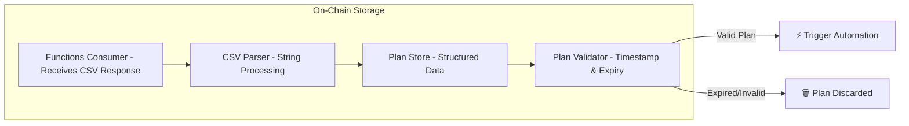
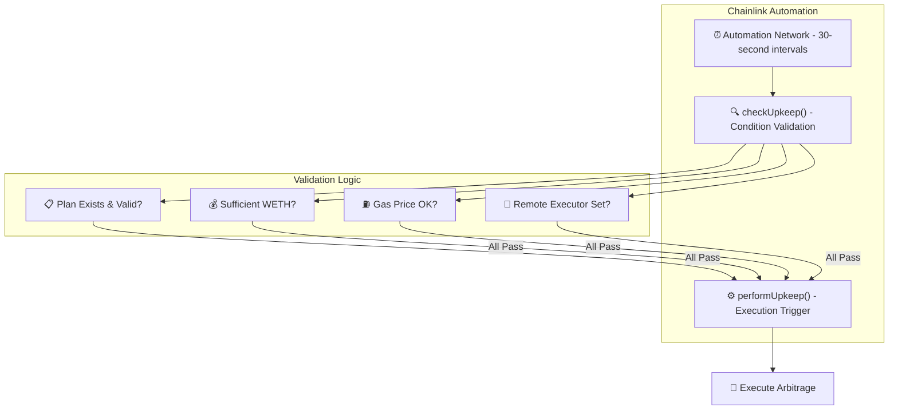
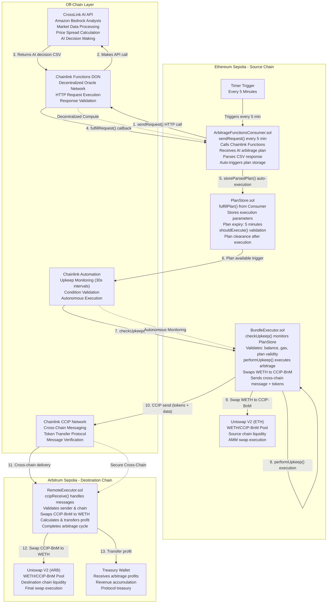
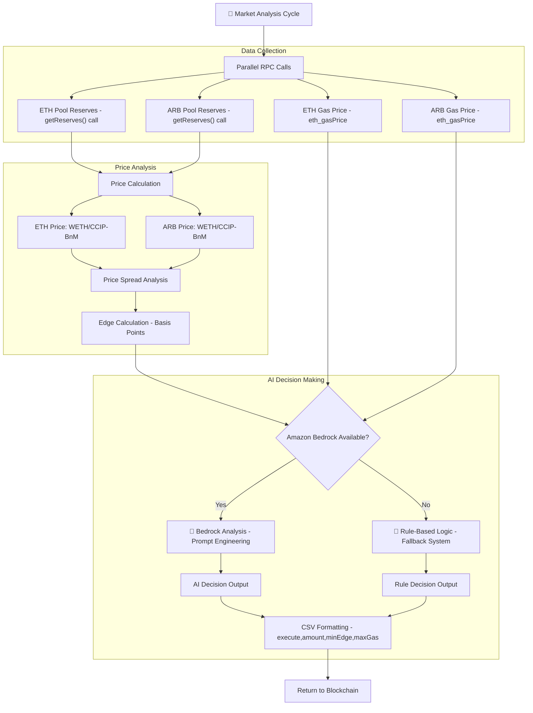

# 🏗️ **CrossLink Arbitor - Technical Architecture**

## **System Overview**

CrossLink Arbitor represents a sophisticated autonomous cross-chain arbitrage system that leverages the complete Chainlink ecosystem. The system operates through multiple interconnected components across different execution environments.

---

## 🔄 **Execution Flow Architecture**

### **Phase 1: Market Analysis & Intelligence**

### **Phase 2: Plan Storage & Validation**

### **Phase 3: Automation & Execution**

### **Phase 4: Cross-Chain Execution**

```mermaid
%%{init: {'theme':'dark'}}%%
sequenceDiagram
    participant BE as ⚙️ Bundle Executor
    participant UNIV2E as 🔄 Uniswap V2 (ETH)
    participant CCIP as 🌉 CCIP Network
    participant RE as 🎯 Remote Executor
    participant UNIV2A as 🔄 Uniswap V2 (ARB)
    participant TREASURY as 🏦 Treasury
    
    Note over BE,TREASURY: Cross-Chain Arbitrage Execution
    
    rect rgb(45, 45, 45)
        Note over BE,UNIV2E: Ethereum Sepolia - Source Chain
        BE->>+UNIV2E: 1. Swap WETH → CCIP-BnM
        UNIV2E->>UNIV2E: 2. Execute AMM Formula
        UNIV2E-->>-BE: 3. Return CCIP-BnM Amount
        
        BE->>BE: 4. Prepare CCIP Message
        Note right of BE: • Token: CCIP-BnM • Data: Amount + Deadline • Destination: Remote Executor
        
        BE->>+CCIP: 5. Send Cross-Chain Transfer
        CCIP-->>-BE: 6. Return Message ID
    end
    
    rect rgb(35, 35, 35)
        Note over CCIP,TREASURY: Cross-Chain Message Routing
        CCIP->>CCIP: 7. Validate Message
        CCIP->>CCIP: 8. Route to Arbitrum
        CCIP->>+RE: 9. Deliver Message + Tokens
    end
    
    rect rgb(50, 50, 50)
        Note over RE,TREASURY: Arbitrum Sepolia - Destination Chain
        RE->>RE: 10. Validate Sender & Chain
        RE->>+UNIV2A: 11. Swap CCIP-BnM → WETH
        UNIV2A->>UNIV2A: 12. Execute AMM Formula
        UNIV2A-->>-RE: 13. Return WETH Amount
        
        RE->>+TREASURY: 14. Transfer Profit
        TREASURY-->>-RE: 15. Confirm Receipt
        RE-->>-CCIP: 16. Execution Complete ✅
    end
```

---

## 🔗 **Complete Contract Flow Architecture**

### **High-Level System Overview with Contract Integration**

### **Detailed Contract Flow & Responsibilities**

#### **⏰ Timing & Execution Cycle**
1. **Every 5 Minutes**: `ArbitrageFunctionsConsumer.sol` triggers `sendRequest()`
2. **Every 30 Seconds**: `BundleExecutor.sol` runs `checkUpkeep()` to monitor for new plans
3. **5 Minute Expiry**: Plans auto-expire to prevent stale executions
4. **Instant Execution**: When conditions are met, arbitrage executes immediately

#### **📋 Contract Responsibilities & Integration**

| Contract | Timing | Chainlink Service | Detailed Responsibilities |
|----------|--------|-------------------|---------------------------|
| **ArbitrageFunctionsConsumer.sol** | Every 5 min | Functions+ Time Based Automation | • `sendRequest()` calls API for AI analysis • `_fulfillRequest()` receives AI decision CSV • `storeParsedPlan()` auto-parses and stores plan • Manages Functions subscription and gas |
| **PlanStore.sol** | On-demand | - | • `fulfillPlan()` stores execution parameters from Consumer • `shouldExecute()` validates plan age (<5 min) and execute flag • `getCurrentPlan()` provides plan details to Automation • `clearPlan()` prevents re-execution after completion |
| **BundleExecutor.sol** | Every 30s | Automation + CCIP | • `checkUpkeep()` monitors PlanStore for valid plans • Validates sufficient WETH balance and gas prices • `performUpkeep()` executes complete arbitrage cycle • `_executeArbitrage()` swaps WETH→CCIP-BnM and sends CCIP message |
| **RemoteExecutor.sol** | Event-driven | CCIP | • `_ccipReceive()` handles incoming cross-chain messages • Validates sender authorization and chain selector • `_completeArbitrage()` swaps CCIP-BnM→WETH • Transfers profit to treasury and completes cycle |

#### **🔄 Complete 13-Step Execution Flow**
1. Timer triggers Consumer every 5 minutes
2. Consumer calls Chainlink Functions with market data request
3. Functions executes HTTP call to CrossLink AI API
4. API analyzes market conditions using Amazon Bedrock
5. Functions returns AI decision CSV to Consumer
6. Consumer auto-parses CSV and stores plan in PlanStore
7. Automation monitors PlanStore every 30 seconds
8. When plan is valid, Automation triggers BundleExecutor
9. BundleExecutor swaps WETH→CCIP-BnM on source chain
10. BundleExecutor sends CCIP message with tokens to destination
11. CCIP delivers message and tokens to RemoteExecutor
12. RemoteExecutor swaps CCIP-BnM→WETH on destination chain
13. RemoteExecutor transfers profit to treasury, cycle complete

---

## 🧠 **AI Decision Engine Architecture**

### **Market Data Processing Pipeline**

---
