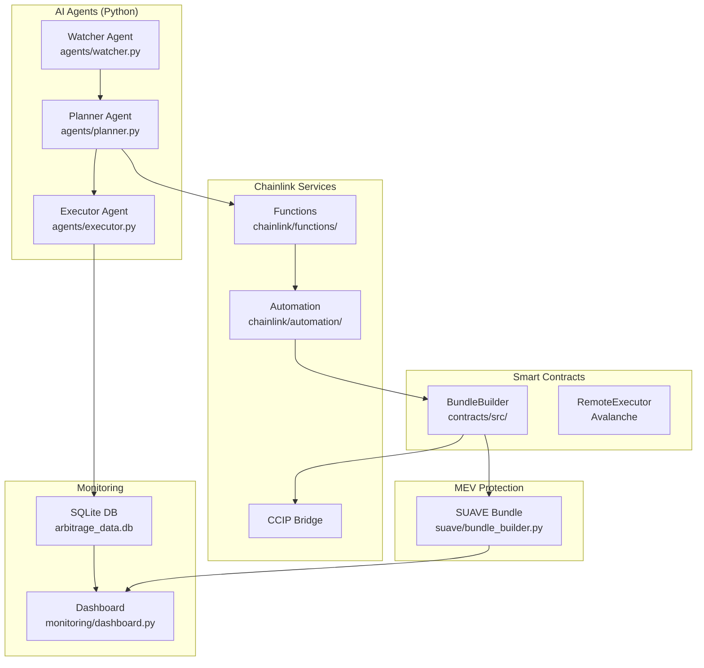
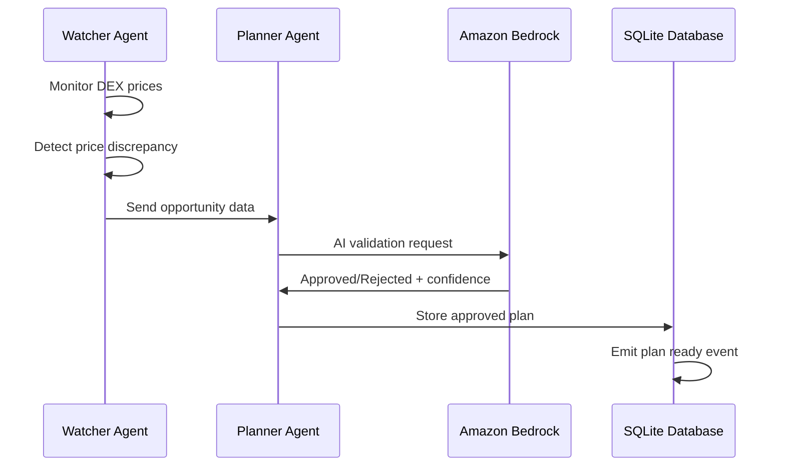
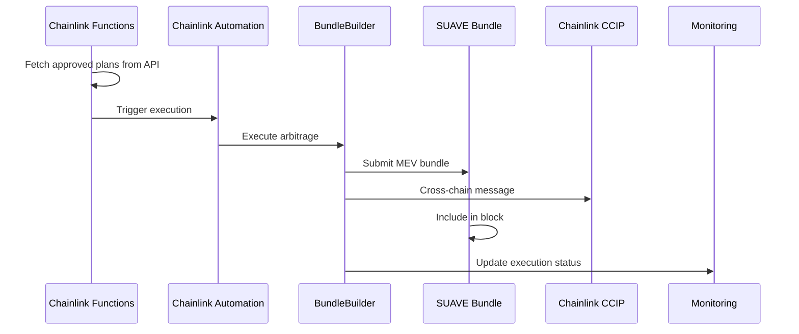
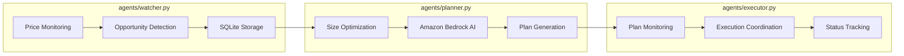

# 🏛️ Cross-Domain Arbitrage Bot - Hackathon Architecture

## 📋 Table of Contents

1. [System Overview](#system-overview)
2. [Simplified Architecture](#simplified-architecture)
3. [Data Flow](#data-flow)
4. [Smart Contract Architecture](#smart-contract-architecture)
5. [AI Agent Architecture](#ai-agent-architecture)
6. [Chainlink Integration](#chainlink-integration)
7. [SUAVE Integration](#suave-integration)
8. [Local Development Setup](#local-development-setup)

## System Overview

The Cross-Domain Arbitrage Bot is a **simplified MEV system** designed for hackathon demonstration. It automatically detects and executes profitable arbitrage opportunities between Arbitrum and Avalanche networks using Chainlink CCIP and SUAVE Helios for MEV protection.

### 🎯 Hackathon Objectives

- **Working Demo**: Demonstrate complete cross-chain arbitrage flow
- **AI Integration**: Amazon Bedrock for intelligent decision making
- **Chainlink Services**: Functions, Automation, and CCIP integration
- **MEV Protection**: SUAVE bundle submission for atomic execution
- **Real-time Monitoring**: Live dashboard for tracking operations

### Key Principles (Simplified)

- **Functionality over Complexity**: Working flow over production-ready features
- **Local Development**: No cloud deployment requirements
- **Demo-Ready**: Visual monitoring and clear logging
- **2-Week Timeline**: Rapid development and testing

## Simplified Architecture



### Component Responsibilities (Hackathon Version)

| Component | Purpose | Technology | Implementation |
|-----------|---------|------------|----------------|
| **Watcher Agent** | Monitor prices and detect opportunities | Python + SQLite | Single file with basic monitoring |
| **Planner Agent** | AI-powered plan generation | Python + Amazon Bedrock | Bedrock API integration |
| **Executor Agent** | Coordinate execution flow | Python + Web3 | Simple orchestration logic |
| **BundleBuilder** | Execute arbitrage trades | Solidity | Simplified contract with pseudo-code |
| **SUAVE Integration** | MEV protection | Python + SUAVE API | Bundle creation and submission |
| **Dashboard** | Real-time monitoring | FastAPI + HTML | Single-file web dashboard |

## Data Flow

### 1. Simplified Opportunity Detection Flow



### 2. Simplified Execution Flow



## Smart Contract Architecture

### Simplified Contract Structure

```
BundleBuilder (Main Contract)
├── Basic arbitrage execution
├── CCIP integration
├── Simple access control
└── Event emission

RemoteExecutor (Destination Chain)
├── CCIP message receiver
├── DEX swap execution
└── Profit tracking
```

### Simplified Storage Layout

```solidity
// Simplified ArbPlan structure
struct ArbPlan {
    address tokenIn;          // Input token
    address tokenOut;         // Output token  
    uint256 amountIn;         // Trade amount
    uint256 expectedProfit;   // Expected profit
    uint256 deadline;         // Execution deadline
    uint64 targetChain;       // Destination chain
    bool executed;            // Execution status
}
```

## AI Agent Architecture

### Single-File Agent Design



### AI Integration Points

1. **Amazon Bedrock Claude**: Plan validation and optimization
2. **Simple Logic**: Basic slippage and gas estimation
3. **Local SQLite**: Data persistence without external dependencies
4. **Async Processing**: Non-blocking operation handling

## Chainlink Integration

### Functions Integration
```javascript
// Simplified Functions source
const source = `
// Fetch approved plans from local API
const response = await Functions.makeHttpRequest({
    url: "http://localhost:8080/api/approved-plans"
});

// Return best plan for execution
return Functions.encodeString(JSON.stringify(bestPlan));
`;
```

### Automation Setup
```javascript
// Register upkeep for plan execution
const upkeepConfig = {
    name: "Cross-Chain Arbitrage Bot",
    upkeepContract: bundleBuilderAddress,
    gasLimit: 500000,
    amount: ethers.utils.parseEther("5") // 5 LINK
};
```

### CCIP Configuration
- **Source Chain**: Arbitrum Sepolia
- **Destination Chain**: Avalanche Fuji  
- **Token Bridging**: WETH, USDC
- **Message Passing**: Execution instructions

## SUAVE Integration

### Bundle Creation Process

```python
# Simplified bundle structure
bundle = {
    "version": "v0.1",
    "inclusion": {"block": "latest", "maxBlock": "latest+2"},
    "body": [{
        "tx": {
            "to": bundleBuilderAddress,
            "data": executeCallData,
            "gasLimit": "0x7A120"
        }
    }]
}
```

### MEV Protection Features
- **Bundle Submission**: Atomic transaction grouping
- **Privacy**: Hide transaction content until inclusion
- **Revert Protection**: All-or-nothing execution
- **Fair Ordering**: Protection against frontrunning

## Local Development Setup

### Database Architecture
```sql
-- SQLite tables for hackathon
CREATE TABLE price_data (
    id INTEGER PRIMARY KEY,
    chain TEXT,
    dex TEXT,
    token_pair TEXT,
    price REAL,
    created_at DATETIME DEFAULT CURRENT_TIMESTAMP
);

CREATE TABLE opportunities (
    id INTEGER PRIMARY KEY,
    token TEXT,
    chain_a TEXT,
    chain_b TEXT,
    price_a REAL,
    price_b REAL,
    spread_bps INTEGER,
    profit_estimate REAL,
    status TEXT DEFAULT 'detected',
    created_at DATETIME DEFAULT CURRENT_TIMESTAMP
);

CREATE TABLE arbitrage_plans (
    plan_id TEXT PRIMARY KEY,
    token TEXT,
    trade_size_usd REAL,
    expected_profit REAL,
    status TEXT,
    created_at DATETIME DEFAULT CURRENT_TIMESTAMP
);

CREATE TABLE executions (
    id INTEGER PRIMARY KEY,
    plan_id TEXT,
    tx_hash TEXT,
    expected_profit REAL,
    actual_profit REAL,
    status TEXT,
    created_at DATETIME DEFAULT CURRENT_TIMESTAMP
);
```

### File Structure
```
├── agents/
│   ├── watcher.py      # Price monitoring
│   ├── planner.py      # AI planning with Bedrock
│   └── executor.py     # Execution coordination
├── chainlink/
│   ├── functions/      # Chainlink Functions
│   └── automation/     # Chainlink Automation
├── contracts/
│   └── src/           # Simplified smart contracts
├── suave/
│   └── bundle_builder.py  # MEV protection
├── monitoring/
│   └── dashboard.py    # Web dashboard
└── scripts/
    └── test_full_flow.py  # End-to-end testing
```

### Development Workflow

1. **Local Setup**: SQLite database and Python virtual environment
2. **Agent Testing**: Individual component testing with mock data
3. **Integration Testing**: Full flow testing with `scripts/test_full_flow.py`
4. **Dashboard Monitoring**: Real-time visualization at `localhost:8080`
5. **Contract Deployment**: Testnet deployment for Chainlink integration

### Performance Expectations

- **Opportunity Detection**: ~5-10 seconds
- **AI Plan Generation**: ~2-5 seconds  
- **Bundle Creation**: ~1-2 seconds
- **Cross-chain Execution**: ~30-60 seconds
- **Total Flow Time**: ~1-2 minutes per opportunity

This simplified architecture enables rapid development and demonstration while maintaining the core cross-chain arbitrage functionality with AI decision-making and MEV protection. 