# 🏛️ Cross-Domain Arbitrage Bot - Architecture Overview

## 📋 Table of Contents

1. [System Overview](#system-overview)
2. [Component Architecture](#component-architecture)
3. [Data Flow](#data-flow)
4. [Smart Contract Architecture](#smart-contract-architecture)
5. [AI Agent Architecture](#ai-agent-architecture)
6. [Chainlink Integration](#chainlink-integration)
7. [SUAVE Integration](#suave-integration)
8. [Security Architecture](#security-architecture)
9. [Scalability Considerations](#scalability-considerations)
10. [Failure Modes & Recovery](#failure-modes--recovery)

## System Overview

The Cross-Domain Arbitrage Bot is a sophisticated MEV (Maximal Extractable Value) system that automatically detects and executes profitable arbitrage opportunities between Arbitrum and Avalanche networks. The system ensures atomic execution across chains using Chainlink CCIP and protects against MEV attacks through SUAVE Helios bundling.

### Key Principles

- **Atomicity**: All operations succeed together or fail together
- **Profitability**: Only execute trades with guaranteed profit margins
- **Security**: Multiple layers of validation and risk management
- **Scalability**: Designed to handle high-frequency operations
- **Transparency**: Full auditability while maintaining MEV protection

## Component Architecture


### Component Responsibilities

| Component | Purpose | Technology | Scalability |
|-----------|---------|------------|-------------|
| **Watcher Agent** | Monitor DEX pools and detect price discrepancies | Python + AWS Bedrock | Horizontal scaling via Lambda |
| **Planner Agent** | Optimize arbitrage routes and calculate profits | Python + Tenderly Forks | Parallel plan generation |
| **Risk Guard** | Assess risks and approve/reject plans | Python + KMS Signing | High availability cluster |
| **PlanStore** | Store and manage arbitrage plans on-chain | Solidity | Gas-optimized storage |
| **EdgeOracle** | Provide real-time price spread data | Solidity + Data Streams | Low-latency updates |
| **BundleBuilder** | Execute first leg of arbitrage | Solidity | Transaction batching |
| **RemoteExecutor** | Execute second leg on destination chain | Solidity | Parallel execution |
| **CCIP Integration** | Handle cross-chain messaging | Chainlink CCIP | Built-in redundancy |

## Data Flow

### 1. Opportunity Detection Flow


### 2. Execution Flow

```mermaid
sequenceDiagram
    participant Auto as Chainlink Automation
    participant BB as BundleBuilder
    participant DEX1 as Origin DEX
    participant CCIP as Chainlink CCIP
    participant RE as RemoteExecutor
    participant DEX2 as Destination DEX
    participant SUAVE as SUAVE Helios
    
    Auto->>BB: checkUpkeep()
    BB->>BB: Validate conditions
    BB->>Auto: Return upkeepNeeded=true
    Auto->>BB: performUpkeep()
    BB->>DEX1: Execute swap (token A → token B)
    BB->>CCIP: Send tokens + calldata
    BB->>SUAVE: Submit bundle
    CCIP->>RE: Deliver message
    RE->>DEX2: Execute swap (token B → stable)
    RE->>RE: Send profits to treasury
    SUAVE->>SUAVE: Include in block or revert all
```



## Smart Contract Architecture

### Contract Hierarchy

```
BundleBuilder (Main Execution)
├── PlanStore (Plan Management)
├── EdgeOracle (Price Data)
├── CCIP Integration
└── Access Control

RemoteExecutor (Destination Chain)
├── CCIP Receiver
├── DEX Integration
└── Treasury Management
```

### Key Design Patterns

- **Upgradeable Proxy Pattern**: For contract upgrades without migration
- **Access Control**: Role-based permissions (Admin, Executor, Emergency)
- **Reentrancy Guards**: Protection against reentrancy attacks  
- **Circuit Breakers**: Emergency stop mechanisms
- **Gas Optimization**: Minimal storage writes, efficient algorithms

### Storage Layout

```solidity
// PlanStore.sol
struct ArbPlan {
    uint256 id;                    // Plan identifier
    uint256 originChainId;         // Source blockchain
    uint256 destinationChainId;    // Target blockchain
    address tokenIn;               // Input token
    address tokenOut;              // Output token
    uint256 amountIn;              // Input amount
    uint256 minAmountOut;          // Minimum output
    uint256 minProfitBps;          // Profit threshold
    uint256 maxGasPrice;           // Gas limit
    uint256 deadline;              // Expiration time
    uint64 ccipChainSelector;      // CCIP destination
    bytes routeData;               // DEX route info
    bytes32 planHash;              // Integrity hash
    bool executed;                 // Execution status
}
```

## AI Agent Architecture

### Multi-Agent System Design


### Agent Communication Patterns

- **Event-Driven**: Agents react to blockchain events and market changes
- **Message Passing**: Asynchronous communication via Redis/SQS
- **State Synchronization**: Shared state through Redis for consistency
- **Circuit Breakers**: Agents can disable themselves in error conditions

### Bedrock Integration

```python
# Pseudo-code for Bedrock agent interaction
class BedrockAgent:
    def __init__(self, model_id: str):
        self.bedrock = boto3.client('bedrock-runtime')
        self.model_id = model_id
    
    async def analyze_opportunity(self, market_data: Dict) -> ArbitragePlan:
        prompt = self.build_analysis_prompt(market_data)
        response = await self.bedrock.invoke_model(
            modelId=self.model_id,
            body=json.dumps({"prompt": prompt})
        )
        return self.parse_response(response)
```

## Chainlink Integration

### Functions Integration

```javascript
// Chainlink Functions source code structure
const source = `
// Data fetching from Bedrock endpoint
const bedrockResponse = await Functions.makeHttpRequest({
    url: bedrockEndpoint,
    method: "GET",
    headers: { "Authorization": "Bearer " + secrets.bedrockToken }
});

// Signature verification
const planData = bedrockResponse.data;
const isValidSignature = verifyKMSSignature(
    planData.planHash, 
    planData.signature,
    secrets.kmsPublicKey
);

if (!isValidSignature) {
    throw new Error("Invalid plan signature");
}

// Return encoded plan data
return Functions.encodeBytes32String(JSON.stringify(planData));
`;
```

### Automation Integration

```solidity
// Automation upkeep logic
function checkUpkeep(bytes calldata checkData) 
    external view returns (bool upkeepNeeded, bytes memory performData) {
    
    uint256 planId = abi.decode(checkData, (uint256));
    ArbPlan memory plan = planStore.getPlan(planId);
    
    // Check execution conditions
    bool gasOk = tx.gasprice <= plan.maxGasPrice;
    bool deadlineOk = block.timestamp <= plan.deadline;
    bool profitOk = edgeOracle.deltaEdge(plan.tokenIn, plan.tokenOut) >= plan.minProfitBps;
    bool notExecuted = !plan.executed;
    
    upkeepNeeded = gasOk && deadlineOk && profitOk && notExecuted;
    performData = abi.encode(planId, plan);
}
```

### Data Streams Integration

```solidity
// Real-time price feed integration
interface IDataStreams {
    function getPrice(bytes32 feedId) external view returns (uint256 price, uint256 timestamp);
    function getPrices(bytes32[] calldata feedIds) external view returns (uint256[] memory, uint256[] memory);
}

contract EdgeOracle {
    IDataStreams public immutable dataStreams;
    
    function deltaEdge(address tokenA, address tokenB) external view returns (uint256) {
        bytes32 feedA = tokenToFeedId[tokenA];
        bytes32 feedB = tokenToFeedId[tokenB];
        
        (uint256 priceA,) = dataStreams.getPrice(feedA);
        (uint256 priceB,) = dataStreams.getPrice(feedB);
        
        // Calculate price difference in basis points
        return calculateBasisPointsDiff(priceA, priceB);
    }
}
```

## SUAVE Integration

### Bundle Building

```python
# SUAVE bundle creation
class SUAVEBundleBuilder:
    def __init__(self, kettle_rpc: str):
        self.w3 = Web3(Web3.HTTPProvider(kettle_rpc))
    
    async def create_arbitrage_bundle(self, plan: ArbitragePlan) -> Dict:
        bundle = {
            "version": "v0.1",
            "inclusion": {
                "block": "latest",
                "maxBlock": "latest+2"
            },
            "body": [
                {
                    "tx": self.build_origin_tx(plan),
                    "canRevert": False
                },
                {
                    "tx": self.build_ccip_tx(plan),
                    "canRevert": False  
                }
            ]
        }
        return bundle
    
    async def submit_bundle(self, bundle: Dict) -> str:
        response = await self.w3.manager.request_async(
            "mev_sendBundle", [bundle]
        )
        return response["bundleHash"]
```

### Auction Mechanism

- **Sealed Bid Auction**: Bundles are submitted with hidden bid amounts
- **Block Builder Integration**: Multiple builders compete for inclusion
- **Atomic Execution**: All transactions in bundle execute together or revert
- **MEV Protection**: Transaction details hidden until block execution

## Security Architecture

### Multi-Layer Security

1. **Input Validation**
   - Parameter bounds checking
   - Signature verification
   - Plan integrity validation

2. **Access Control**
   - Role-based permissions
   - Multi-signature requirements
   - Time-locked admin functions

3. **Economic Security**
   - Slippage protection
   - Gas price limits
   - Profit thresholds

4. **Technical Security**
   - Reentrancy guards
   - Integer overflow protection
   - External call safety

### Risk Management

```solidity
contract RiskManager {
    struct RiskParameters {
        uint256 maxSlippageBps;      // Maximum slippage allowed
        uint256 maxGasMultiplier;    // Gas price safety factor
        uint256 maxTradeSize;        // Position size limit
        uint256 cooldownPeriod;      // Time between trades
    }
    
    function validateExecution(ArbPlan memory plan) external view {
        require(plan.minProfitBps >= riskParams.minProfitBps, "Insufficient profit");
        require(plan.amountIn <= riskParams.maxTradeSize, "Trade size too large");
        require(block.timestamp >= lastExecution + riskParams.cooldownPeriod, "Cooldown active");
    }
}
```

## Scalability Considerations

### Horizontal Scaling

- **AI Agents**: Serverless Lambda functions for unlimited scaling
- **Database**: Sharded PostgreSQL for high throughput
- **Cache Layer**: Redis clustering for low-latency access
- **Message Queue**: SQS/SNS for reliable message delivery

### Vertical Optimization

- **Smart Contracts**: Gas-optimized assembly where needed
- **Data Structures**: Efficient packing and storage patterns
- **Algorithms**: O(1) lookups where possible
- **Batch Processing**: Group operations to reduce overhead

### Performance Metrics

- **Latency**: < 100ms from opportunity detection to execution
- **Throughput**: 1000+ opportunities processed per minute
- **Availability**: 99.9% uptime with automatic failover
- **Accuracy**: < 0.1% false positive rate for opportunities

## Failure Modes & Recovery

### Failure Scenarios

1. **AI Agent Failures**
   - **Detection**: Health checks and heartbeats
   - **Recovery**: Automatic restart and state restoration
   - **Fallback**: Manual override capabilities

2. **Network Congestion**
   - **Detection**: Gas price monitoring
   - **Recovery**: Dynamic gas pricing
   - **Fallback**: Pause execution until congestion clears

3. **Smart Contract Issues**
   - **Detection**: Failed transaction monitoring
   - **Recovery**: Emergency pause and investigation
   - **Fallback**: Upgrade path through proxy contracts

4. **Cross-Chain Bridge Delays**
   - **Detection**: Message delivery timeouts
   - **Recovery**: Retry mechanisms with exponential backoff
   - **Fallback**: Manual intervention tools

### Recovery Mechanisms

```solidity
contract EmergencyManager {
    event EmergencyPause(string reason, uint256 timestamp);
    event EmergencyResume(uint256 timestamp);
    
    bool public emergencyPaused;
    mapping(address => bool) public emergencyOperators;
    
    modifier whenNotPaused() {
        require(!emergencyPaused, "Emergency pause active");
        _;
    }
    
    function emergencyPause(string calldata reason) external {
        require(emergencyOperators[msg.sender], "Not authorized");
        emergencyPaused = true;
        emit EmergencyPause(reason, block.timestamp);
    }
}
```

### Monitoring & Alerting

- **Real-time Dashboards**: Key metrics and system health
- **Automated Alerts**: Slack/Discord notifications for issues
- **Performance Tracking**: Historical data and trend analysis
- **Audit Logs**: Complete transaction and decision history

---

This architecture provides a robust, scalable, and secure foundation for cross-domain arbitrage operations while maintaining the flexibility to adapt to changing market conditions and technological advances. 