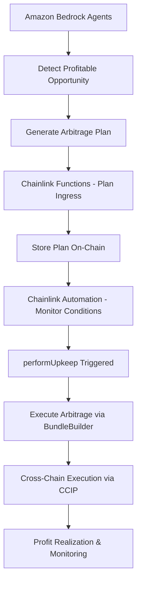

# 👥 Team Tasks - Cross-Chain Arbitrage Bot (3 Developers)

## 🎯 Project Overview

**Cross-Domain MEV Bot** with AI decision-making, Chainlink services integration, and SUAVE MEV protection.

**Timeline**: 4-5 weeks  
**Team Size**: 3 developers  
**Focus**: Production-ready arbitrage bot with comprehensive features

## 👨‍💻 Team Structure

### Developer 1: Smart Contracts & Core Infrastructure
**Primary Focus**: Smart contract development, Foundry setup, and SUAVE integration

### Developer 2: AI Agents & Backend Systems
**Primary Focus**: AI-powered opportunity detection, Amazon Bedrock integration, and monitoring

### Developer 3: Chainlink Services & System Integration
**Primary Focus**: Chainlink Functions, Automation, CCIP, Data Streams, and full system integration

## 📅 Development Timeline

### Week 1: Foundation & Core Setup

#### Developer 1: Smart Contracts Foundation
**Tasks:**
- Set up Foundry development environment
- Implement core interfaces:
  - `IBundleBuilder.sol`
  - `IPlanStore.sol` 
  - `IEdgeOracle.sol`
- Create basic `BundleBuilder.sol` contract structure
- Write initial unit tests and deployment scripts

#### Developer 2: AI Architecture Setup
**Tasks:**
- Set up Amazon Bedrock development environment
- Implement shared data models (`agents/shared/models.py`)
- Create Watcher Agent skeleton for pool monitoring
- Set up DEX data collection pipeline and database schema

#### Developer 3: Chainlink Services Setup
**Tasks:**
- Set up Chainlink Functions development environment
- Research and design plan ingress architecture
- Set up Chainlink Automation environment
- Create initial upkeep contract structure

### Week 2: Core Component Development

#### Developer 1: Contract Logic Implementation
**Tasks:**
- Implement bundle building logic in `BundleBuilder.sol`
- Add price validation and slippage protection
- Implement atomic swap mechanisms
- Create gas optimization strategies
- Begin CCIP integration for cross-chain messaging

#### Developer 2: AI Agents Development
**Tasks:**
- Implement pool monitoring logic (`agents/watcher/pool_monitor.py`)
- Add price difference detection algorithms
- Create real-time data processing pipeline
- Integrate with multiple DEX APIs (Uniswap, Trader Joe, etc.)

#### Developer 3: Chainlink Functions Implementation
**Tasks:**
- Implement plan ingress functions (Bedrock → on-chain)
- Create off-chain computation scripts
- Develop Functions source code for AI plan fetching
- Test Functions on testnets

### Week 3: Advanced Features & Integration

#### Developer 1: Cross-Chain & SUAVE Integration
**Tasks:**
- Complete Chainlink CCIP integration
- Implement bridge logic and message handling
- Set up SUAVE development environment
- Begin MEV protection implementation

#### Developer 2: Advanced AI Features
**Tasks:**
- Develop Planner Agent for strategy optimization
- Implement Risk Guard Agent for validation
- Add machine learning models for profit prediction
- Create agent coordination and communication system

#### Developer 3: Chainlink Automation & Data Streams
**Tasks:**
- Implement upkeep contracts with conditional execution
- Add automated execution triggers (performUpkeep logic)
- Integrate Chainlink Data Streams for live pricing
- Create cross-chain state management

### Week 4: Full System Integration

#### Developer 1: SUAVE & Testing
**Tasks:**
- Complete SUAVE block auction implementation
- Comprehensive smart contract testing
- Deploy to Arbitrum and Avalanche testnets
- Security testing and optimization

#### Developer 2: Monitoring & Integration
**Tasks:**
- Implement comprehensive monitoring dashboard
- Add alerting and notification systems
- Integrate agents with Chainlink Functions
- Performance optimization and testing

#### Developer 3: End-to-End Integration
**Tasks:**
- Connect all Chainlink services together
- Full system integration testing
- Cross-chain flow testing
- Performance benchmarking

### Week 5: Optimization & Deployment

#### All Developers: Final Push
**Tasks:**
- Final integration testing and bug fixes
- Gas optimization and security auditing
- Documentation completion
- Demo preparation and deployment

## 🔧 Technical Flow Explanation

### How Amazon Bedrock → Chainlink Functions → Chainlink Automation Works



#### Detailed Technical Connection:

1. **Amazon Bedrock (Off-Chain AI)**
   - Watcher Agent monitors DEX prices across Arbitrum & Avalanche
   - Detects price discrepancies > threshold (e.g., 50 basis points)
   - Planner Agent calculates optimal trade size and profit
   - Risk Guard validates the opportunity

2. **Chainlink Functions (Plan Ingress)**
   ```javascript
   // chainlink/functions/source.js
   const response = await Functions.makeHttpRequest({
     url: "https://bedrock-api.example.com/get-plan",
     method: "GET"
   });
   
   return Functions.encodeString(JSON.stringify(response.data));
   ```
   - Functions periodically fetch approved plans from Bedrock
   - Brings off-chain AI decisions on-chain
   - Stores plan in `PlanStore` smart contract

3. **Chainlink Automation (Execution Trigger)**
   ```solidity
   function checkUpkeep(bytes calldata) external view override 
   returns (bool upkeepNeeded, bytes memory performData) {
       ArbitragePlan memory plan = planStore.getLatestPlan();
       bool conditionsMet = checkMarketConditions(plan);
       bool timeWindowOpen = block.timestamp >= plan.executionTime;
       
       upkeepNeeded = conditionsMet && timeWindowOpen;
       performData = abi.encode(plan.id);
   }
   
   function performUpkeep(bytes calldata performData) external override {
       uint256 planId = abi.decode(performData, (uint256));
       bundleBuilder.executeArbitrage(planId);
   }
   ```
   - Monitors on-chain conditions (price, time, gas)
   - Automatically triggers execution when conditions are met
   - Calls `BundleBuilder.executeArbitrage()` to perform trades

## 🎯 Critical Integration Points

### Week 2 Milestone
- Smart contracts + Chainlink Functions integration
- AI agents producing valid arbitrage plans
- Basic on-chain plan storage working

### Week 3 Milestone  
- Chainlink Automation triggering executions
- Cross-chain messaging via CCIP functional
- End-to-end flow from detection to execution

### Week 4 Milestone
- SUAVE MEV protection integrated
- Full monitoring and alerting system
- Production-ready deployment

## 📊 Success Metrics

- **Detection Latency**: < 500ms for price discrepancy detection
- **Execution Speed**: < 30 seconds from trigger to completion
- **Profit Accuracy**: > 90% of predicted vs actual profit
- **Success Rate**: > 95% of triggered executions complete successfully

## 🚨 Risk Mitigation

### Technical Risks
- **Cross-chain latency**: Early CCIP testing and optimization
- **AI model accuracy**: Continuous backtesting and validation
- **MEV competition**: SUAVE integration and bundle protection
- **Gas optimization**: Regular benchmarking and optimization

### Coordination Risks
- **Daily standups**: 15-minute sync meetings
- **Weekly integration**: Friday full-team integration testing
- **Shared documentation**: Real-time updates in project wiki

## 🎯 Demo Scenarios

### Primary Demo Flow
1. **Show Dashboard**: `http://localhost:8080`
2. **Trigger Opportunity**: Run price monitoring
3. **AI Planning**: Display Bedrock integration
4. **Chainlink Execution**: Show Functions/Automation
5. **SUAVE Protection**: Bundle creation
6. **Cross-chain**: CCIP message flow
7. **Results**: Dashboard updates with profits

### Backup Demo Components
- **Static Data**: Pre-generated opportunities
- **Mock APIs**: Simulated external services
- **Recorded Flows**: Video backup of working system

## 📈 Post-Hackathon Roadmap

### Potential Enhancements
1. **Production Security**: KMS integration, multi-sig
2. **Advanced AI**: ML models, predictive analytics
3. **Multi-DEX Support**: More arbitrage opportunities
4. **Gas Optimization**: Dynamic gas pricing
5. **Real-time Alerts**: Discord/Slack notifications

This simplified team structure ensures rapid development while maintaining all core functionalities for a compelling hackathon demonstration! 🚀 