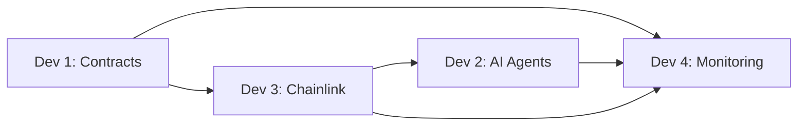

# 👥 Team Task Division - Cross-Domain Arbitrage Bot

## 🎯 Project Timeline: 4-5 Weeks

This document divides the project into 4 specialized development tracks for optimal parallel development.

---

## 👨‍💻 Developer 1: Smart Contracts & Foundry Lead
**Duration:** 4 weeks | **Expertise:** Solidity, Foundry, MEV

### Week 1: Core Infrastructure
- [ ] Setup Foundry project structure
- [ ] Implement `IBundleBuilder` interface
- [ ] Create `PlanStore` contract for plan management
- [ ] Implement `EdgeOracle` with Data Streams integration
- [ ] Setup comprehensive test suite

### Week 2: Execution Logic
- [ ] Implement `BundleBuilder` main execution contract
- [ ] Add DEX integration (SushiSwap, Uniswap V3)
- [ ] Implement CCIP sending functionality
- [ ] Create `RemoteExecutor` for Avalanche
- [ ] Add emergency stop mechanisms

### Week 3: Advanced Features
- [ ] Implement risk management systems
- [ ] Add gas optimization techniques
- [ ] Create upgrade proxy patterns
- [ ] Implement access control systems
- [ ] Add comprehensive event logging

### Week 4: Testing & Deployment
- [ ] Write comprehensive unit tests
- [ ] Conduct fork testing on mainnet forks
- [ ] Deploy to testnets (Arbitrum Sepolia, Avalanche Fuji)
- [ ] Perform gas optimization analysis
- [ ] Create deployment scripts and documentation

### Key Deliverables:
- ✅ Fully tested smart contract suite
- ✅ Deployment scripts for testnet/mainnet
- ✅ Gas optimization report
- ✅ Security audit preparation

---

## 🤖 Developer 2: AI Agents & Bedrock Integration Lead
**Duration:** 4 weeks | **Expertise:** Python, AWS, ML/AI

### Week 1: Agent Architecture
- [ ] Setup AWS Bedrock development environment
- [ ] Implement core data models (`models.py`)
- [ ] Create base agent classes and communication patterns
- [ ] Setup Redis for inter-agent communication
- [ ] Implement configuration management

### Week 2: Watcher Agent
- [ ] Implement pool monitoring system
- [ ] Create price tracking mechanisms
- [ ] Setup blockchain event listeners
- [ ] Implement opportunity detection algorithms
- [ ] Add real-time data processing

### Week 3: Planner & Risk Guard
- [ ] Implement route optimization using Bedrock
- [ ] Create profit calculation engine
- [ ] Setup Tenderly fork simulation
- [ ] Implement risk assessment logic
- [ ] Add AWS KMS signing functionality

### Week 4: Integration & Optimization
- [ ] Integrate all agents into cohesive system
- [ ] Implement error handling and retry logic
- [ ] Add comprehensive logging and monitoring
- [ ] Performance optimization and scaling
- [ ] Create agent deployment scripts

### Key Deliverables:
- ✅ Three working AI agents (Watcher, Planner, Risk Guard)
- ✅ AWS Bedrock integration
- ✅ KMS signing system
- ✅ Agent orchestration framework

---

## 🔗 Developer 3: Chainlink Services & CCIP Lead
**Duration:** 4 weeks | **Expertise:** Chainlink, Node.js, Cross-chain

### Week 1: Functions Integration
- [ ] Setup Chainlink Functions development environment
- [ ] Implement Functions source code for plan ingestion
- [ ] Create subscription and consumer contracts
- [ ] Setup DON (Decentralized Oracle Network) integration
- [ ] Implement signature verification in Functions

### Week 2: Automation System
- [ ] Setup Chainlink Automation (Upkeep)
- [ ] Implement `checkUpkeep` logic
- [ ] Create automation registration scripts
- [ ] Setup conditional execution triggers
- [ ] Implement gas-efficient automation patterns

### Week 3: CCIP & Data Streams
- [ ] Implement CCIP cross-chain messaging
- [ ] Setup message routing between Arbitrum/Avalanche
- [ ] Integrate Data Streams for real-time prices
- [ ] Create price feed management system
- [ ] Implement cross-chain state synchronization

### Week 4: Integration & Testing
- [ ] Integrate all Chainlink services
- [ ] Test cross-chain message delivery
- [ ] Implement error handling and retries
- [ ] Setup monitoring for Chainlink services
- [ ] Create service deployment guides

### Key Deliverables:
- ✅ Chainlink Functions integration
- ✅ Automation system for execution triggers
- ✅ CCIP cross-chain messaging
- ✅ Data Streams price feeds

---

## 📊 Developer 4: SUAVE Integration & Monitoring Lead
**Duration:** 4 weeks | **Expertise:** SUAVE, MEV, Monitoring, DevOps

### Week 1: SUAVE Integration
- [ ] Setup SUAVE development environment
- [ ] Implement bundle building logic
- [ ] Create SUAVE auction client
- [ ] Setup Kettle RPC integration
- [ ] Implement MEV protection mechanisms

### Week 2: Bundle Optimization
- [ ] Implement atomic bundle creation
- [ ] Add transaction ordering optimization
- [ ] Create bid strategy algorithms
- [ ] Setup bundle simulation and testing
- [ ] Implement failure handling

### Week 3: Monitoring Dashboard
- [ ] Create FastAPI/Flask monitoring dashboard
- [ ] Implement real-time metrics collection
- [ ] Setup Prometheus/Grafana integration
- [ ] Create profit tracking system
- [ ] Add alert system (Discord/Telegram)

### Week 4: Infrastructure & Deployment
- [ ] Setup Docker containerization
- [ ] Create CI/CD pipelines
- [ ] Implement production monitoring
- [ ] Setup logging and error tracking
- [ ] Create operational runbooks

### Key Deliverables:
- ✅ SUAVE bundle system
- ✅ MEV protection implementation
- ✅ Comprehensive monitoring dashboard
- ✅ Production-ready infrastructure

---

## 🔄 Cross-Team Collaboration

### Daily Standups (15 min)
- **Time:** 9:00 AM UTC
- **Format:** Progress, blockers, dependencies
- **Tools:** Slack/Discord

### Weekly Integration Sessions (2 hours)
- **Time:** Friday 2:00 PM UTC
- **Purpose:** Component integration and testing
- **Deliverable:** Working system demo

### Communication Channels
- **Slack/Discord:** Real-time communication
- **GitHub:** Code collaboration and issue tracking
- **Notion/Linear:** Task management and documentation

---

## 📅 Milestone Schedule

### Week 1 Milestone: Foundation
- [ ] All development environments setup
- [ ] Basic component skeletons implemented
- [ ] Communication infrastructure established

### Week 2 Milestone: Core Functionality
- [ ] Smart contracts deployed to testnet
- [ ] AI agents detecting opportunities
- [ ] Chainlink services operational

### Week 3 Milestone: Integration
- [ ] End-to-end system integration
- [ ] Cross-chain messaging working
- [ ] SUAVE bundling functional

### Week 4 Milestone: Production Ready
- [ ] Comprehensive testing completed
- [ ] Monitoring and alerting operational
- [ ] Documentation and deployment guides

### Week 5 Milestone: Optimization & Launch
- [ ] Performance optimization
- [ ] Security audit completion
- [ ] Mainnet deployment (if approved)

---

## 🛠️ Shared Resources

### Development Tools
- **Git Repository:** GitHub with branch protection
- **CI/CD:** GitHub Actions
- **Testing:** Automated test suites
- **Documentation:** README, API docs, architecture guides

### Testing Strategy
- **Unit Tests:** Each component individually tested
- **Integration Tests:** Cross-component functionality
- **End-to-End Tests:** Full arbitrage simulation
- **Performance Tests:** Load and stress testing

### Dependencies & Handoffs

---

## 🎯 Success Metrics

- [ ] **Functionality:** System successfully executes profitable arbitrage
- [ ] **Performance:** <100ms latency from detection to execution
- [ ] **Reliability:** 99.9% uptime with automatic failover
- [ ] **Profitability:** Consistent positive returns after gas costs
- [ ] **Security:** No exploits or unauthorized access

---

**Ready to build the future of cross-chain MEV? Let's ship this! 🚀** 