# 🏗️ **ChainFlow AI - Technical Architecture**

## **System Overview**

ChainFlow AI represents a sophisticated autonomous cross-chain arbitrage system that leverages the complete Chainlink ecosystem. The system operates through multiple interconnected components across different execution environments.

---

## 🎯 **Core Architecture Principles**

### **1. Autonomous Execution**
- **Zero Human Intervention**: System operates 24/7 without manual oversight
- **Event-Driven Architecture**: Each component responds to specific triggers
- **Fail-Safe Mechanisms**: Built-in safety checks prevent unprofitable operations

### **2. Multi-Chain Coordination**
- **Cross-Chain State Management**: Maintains consistency across Ethereum and Arbitrum
- **Atomic Operations**: Ensures complete execution or full rollback
- **Message Verification**: Cryptographic proof of cross-chain communications

### **3. AI-Enhanced Decision Making**
- **Hybrid Intelligence**: Combines AI analysis with rule-based fallbacks
- **Real-Time Processing**: Sub-minute decision making on market opportunities
- **Risk Assessment**: Multi-factor analysis including gas costs and market volatility

---

## 🔄 **Execution Flow Architecture**

### **Phase 1: Market Analysis & Intelligence**

```mermaid
graph TB
    subgraph "Off-Chain Intelligence Layer"
        TIMER["⏰ 5-Minute Timer - Chainlink Automation"]
        FC["📞 Functions Consumer - ArbitrageFunctionsConsumer.sol"]
        API["🌐 ChainFlow API - Express.js Server"]
        AI["🧠 Amazon Bedrock - Titan Text Express"]
    end
    
    subgraph "Data Sources"
        ETH_RPC["📡 Ethereum RPC - Pool Reserves"]
        ARB_RPC["📡 Arbitrum RPC - Pool Reserves"]
        GAS_ORACLE["⛽ Gas Price Oracle - Both Chains"]
    end
    
    TIMER -->|Trigger| FC
    FC -->|HTTP Request| API
    API -->|Parallel Fetch| ETH_RPC
    API -->|Parallel Fetch| ARB_RPC
    API -->|Fetch| GAS_ORACLE
    API -->|Market Data| AI
    AI -->|Decision| API
    API -->|CSV Response| FC
```



### **Phase 2: Plan Storage & Validation**

```mermaid
graph LR
    subgraph "On-Chain Storage"
        FC["Functions Consumer - Receives CSV Response"]
        PARSER["CSV Parser - String Processing"]
        PS["Plan Store - Structured Data"]
        VALIDATOR["Plan Validator - Timestamp & Expiry"]
    end
    
    FC --> PARSER
    PARSER --> PS
    PS --> VALIDATOR
    VALIDATOR -->|Valid Plan| AUTOMATION_TRIGGER
    VALIDATOR -->|Expired/Invalid| DISCARD
    
    AUTOMATION_TRIGGER["⚡ Trigger Automation"]
    DISCARD["🗑️ Plan Discarded"]
```



### **Phase 3: Automation & Execution**

```mermaid
graph TB
    subgraph "Chainlink Automation"
        AUTO["⏰ Automation Network - 30-second intervals"]
        CHECK["🔍 checkUpkeep() - Condition Validation"]
        PERFORM["⚙️ performUpkeep() - Execution Trigger"]
    end
    
    subgraph "Validation Logic"
        PLAN_CHECK["📋 Plan Exists & Valid?"]
        BALANCE_CHECK["💰 Sufficient WETH?"]
        GAS_CHECK["⛽ Gas Price OK?"]
        REMOTE_CHECK["🔗 Remote Executor Set?"]
    end
    
    AUTO --> CHECK
    CHECK --> PLAN_CHECK
    CHECK --> BALANCE_CHECK  
    CHECK --> GAS_CHECK
    CHECK --> REMOTE_CHECK
    
    PLAN_CHECK -->|All Pass| PERFORM
    BALANCE_CHECK -->|All Pass| PERFORM
    GAS_CHECK -->|All Pass| PERFORM
    REMOTE_CHECK -->|All Pass| PERFORM
    
    PERFORM --> EXECUTE["🚀 Execute Arbitrage"]
```



### **Phase 4: Cross-Chain Execution**

```mermaid
%%{init: {'theme':'dark'}}%%
sequenceDiagram
    participant BE as ⚙️ Bundle Executor
    participant UNIV2E as 🔄 Uniswap V2 (ETH)
    participant CCIP as 🌉 CCIP Network
    participant RE as 🎯 Remote Executor
    participant UNIV2A as 🔄 Uniswap V2 (ARB)
    participant TREASURY as 🏦 Treasury
    
    Note over BE,TREASURY: Cross-Chain Arbitrage Execution
    
    rect rgb(45, 45, 45)
        Note over BE,UNIV2E: Ethereum Sepolia - Source Chain
        BE->>+UNIV2E: 1. Swap WETH → CCIP-BnM
        UNIV2E->>UNIV2E: 2. Execute AMM Formula
        UNIV2E-->>-BE: 3. Return CCIP-BnM Amount
        
        BE->>BE: 4. Prepare CCIP Message
        Note right of BE: • Token: CCIP-BnM • Data: Amount + Deadline • Destination: Remote Executor
        
        BE->>+CCIP: 5. Send Cross-Chain Transfer
        CCIP-->>-BE: 6. Return Message ID
    end
    
    rect rgb(35, 35, 35)
        Note over CCIP,TREASURY: Cross-Chain Message Routing
        CCIP->>CCIP: 7. Validate Message
        CCIP->>CCIP: 8. Route to Arbitrum
        CCIP->>+RE: 9. Deliver Message + Tokens
    end
    
    rect rgb(50, 50, 50)
        Note over RE,TREASURY: Arbitrum Sepolia - Destination Chain
        RE->>RE: 10. Validate Sender & Chain
        RE->>+UNIV2A: 11. Swap CCIP-BnM → WETH
        UNIV2A->>UNIV2A: 12. Execute AMM Formula
        UNIV2A-->>-RE: 13. Return WETH Amount
        
        RE->>+TREASURY: 14. Transfer Profit
        TREASURY-->>-RE: 15. Confirm Receipt
        RE-->>-CCIP: 16. Execution Complete ✅
    end
```



---

## 🔗 **Complete Contract Flow Architecture**

### **High-Level System Overview with Contract Integration**

```mermaid
graph TB
    subgraph "🌐 Off-Chain Layer"
        API["ChainFlow AI API<br/>Amazon Bedrock + Express.js"]
        FUNCTIONS["⚡ Chainlink Functions<br/>DON Network"]
        AUTOMATION["🤖 Chainlink Automation<br/>Upkeep Network"]
        CCIP_NET["🌉 Chainlink CCIP<br/>Cross-Chain Infrastructure"]
    end
    
    subgraph "📡 Ethereum Sepolia"
        AFC["ArbitrageFunctionsConsumer.sol<br/>• Functions Integration<br/>• AI Decision Parsing<br/>• Plan Creation"]
        PS["PlanStore.sol<br/>• Execution Plans<br/>• Timestamp Validation<br/>• Plan Expiry (5 min)"]
        BE["BundleExecutor.sol<br/>• Automation Target<br/>• DEX Integration<br/>• CCIP Sender"]
        UNIV2_ETH["Uniswap V2 Router<br/>• WETH/CCIP-BnM Pool<br/>• Source Chain DEX"]
    end
    
    subgraph "🔺 Arbitrum Sepolia"
        RE["RemoteExecutor.sol<br/>• CCIP Receiver<br/>• Final Execution<br/>• Profit Distribution"]
        UNIV2_ARB["Uniswap V2 Router<br/>• WETH/CCIP-BnM Pool<br/>• Destination Chain DEX"]
        TREASURY["Treasury Wallet<br/>• Profit Collection<br/>• Revenue Distribution"]
    end
    
    %% Flow connections
    API -->|Market Data| FUNCTIONS
    FUNCTIONS -->|HTTP Response| AFC
    AFC -->|Store Plan| PS
    PS -->|Plan Available| AUTOMATION
    AUTOMATION -->|Trigger Execution| BE
    BE -->|Swap WETH→CCIP-BnM| UNIV2_ETH
    BE -->|Send Tokens + Data| CCIP_NET
    CCIP_NET -->|Cross-Chain Delivery| RE
    RE -->|Swap CCIP-BnM→WETH| UNIV2_ARB
    RE -->|Transfer Profit| TREASURY
    
    %% Chainlink service connections
    FUNCTIONS -.->|Decentralized Compute| AFC
    AUTOMATION -.->|Autonomous Execution| BE
    CCIP_NET -.->|Secure Messaging| RE
```



### **Contract Responsibilities & Chainlink Integration**

| Contract | Primary Role | Chainlink Service | Key Functions |
|----------|--------------|-------------------|---------------|
| **ArbitrageFunctionsConsumer** | AI Decision Gateway | Functions | `sendRequest()`, `fulfillRequest()`, `storeParsedPlan()` |
| **PlanStore** | Execution Coordinator | - | `fulfillPlan()`, `shouldExecute()`, `clearPlan()` |
| **BundleExecutor** | Automation & CCIP Sender | Automation + CCIP | `checkUpkeep()`, `performUpkeep()`, `_executeArbitrage()` |
| **RemoteExecutor** | Cross-Chain Receiver | CCIP | `_ccipReceive()`, `_completeArbitrage()` |

---

## 🧠 **AI Decision Engine Architecture**

### **Market Data Processing Pipeline**

```mermaid
flowchart TD
    START["🚀 Market Analysis Cycle"] --> PARALLEL_FETCH
    
    subgraph "Data Collection"
        PARALLEL_FETCH["Parallel RPC Calls"] --> ETH_RESERVES["ETH Pool Reserves - getReserves() call"]
        PARALLEL_FETCH --> ARB_RESERVES["ARB Pool Reserves - getReserves() call"]
        PARALLEL_FETCH --> ETH_GAS["ETH Gas Price - eth_gasPrice"]
        PARALLEL_FETCH --> ARB_GAS["ARB Gas Price - eth_gasPrice"]
    end
    
    ETH_RESERVES --> PRICE_CALC
    ARB_RESERVES --> PRICE_CALC
    
    subgraph "Price Analysis"
        PRICE_CALC["Price Calculation"] --> ETH_PRICE["ETH Price: WETH/CCIP-BnM"]
        PRICE_CALC --> ARB_PRICE["ARB Price: WETH/CCIP-BnM"]
        ETH_PRICE --> SPREAD["Price Spread Analysis"]
        ARB_PRICE --> SPREAD
        SPREAD --> EDGE["Edge Calculation - Basis Points"]
    end
    
    EDGE --> AI_ENGINE
    ETH_GAS --> AI_ENGINE
    ARB_GAS --> AI_ENGINE
    
    subgraph "AI Decision Making"
        AI_ENGINE{"Amazon Bedrock Available?"}
        AI_ENGINE -->|Yes| BEDROCK["🤖 Bedrock Analysis - Prompt Engineering"]
        AI_ENGINE -->|No| RULES["📏 Rule-Based Logic - Fallback System"]
        
        BEDROCK --> AI_DECISION["AI Decision Output"]
        RULES --> RULE_DECISION["Rule Decision Output"]
        
        AI_DECISION --> FORMAT
        RULE_DECISION --> FORMAT
    end
    
    FORMAT["CSV Formatting - execute,amount,minEdge,maxGas"] --> RETURN["Return to Blockchain"]
```



### **AI Prompt Engineering**

The system uses sophisticated prompt engineering to ensure reliable AI decisions:

```javascript
const prompt = `Analyze this arbitrage opportunity:

Market Conditions:
- ETH price: ${ethPrice} CCIP-BnM per WETH
- ARB price: ${arbPrice} CCIP-BnM per WETH  
- Price difference: ${edge} basis points
- ETH gas: ${ethGas} gwei
- ARB gas: ${arbGas} gwei

Trading Rules:
- Minimum profitable edge: 50 basis points
- Maximum acceptable gas: 50 gwei on both chains
- Standard trade size: 1 WETH (1000000000000000000 wei)

Risk Factors:
- Gas cost impact on profitability
- Market volatility considerations
- Execution time requirements

Respond with JSON only:
{
  "execute": true/false,
  "amount": "wei_amount_string", 
  "minEdgeBps": 50,
  "maxGasGwei": 50
}`;
```

---

## 🔒 **Security Architecture**

### **Access Control Matrix**

| Component | Admin Functions | User Functions | External Calls |
|-----------|----------------|----------------|----------------|
| **Functions Consumer** | `storeTestPlan()` | `sendRequest()` | Chainlink Functions |
| **Plan Store** | `setFunctionsConsumer()`, `setBundleExecutor()` | `getCurrentPlan()` | None |
| **Bundle Executor** | `setRemoteExecutor()`, `setMaxGasPrice()` | `checkUpkeep()` | CCIP Router, DEX |
| **Remote Executor** | `setAuthorizedSender()`, `setMinProfitThreshold()` | None | DEX Router |

### **Circular Dependency Resolution**

The system implements an innovative solution to the circular dependency problem:


### **Safety Mechanisms**

1. **Plan Expiration**: 5-minute maximum age prevents stale executions
2. **Gas Price Limits**: Prevents execution during high gas periods  
3. **Balance Validation**: Ensures sufficient funds before execution
4. **Reentrancy Guards**: SafeERC20 usage prevents attack vectors
5. **Emergency Stops**: Owner can pause system if needed

---

## ⚡ **Performance Architecture**

### **Execution Timing**

| Phase | Duration | Trigger | Optimization |
|-------|----------|---------|-------------|
| **Market Analysis** | ~10-15 seconds | Timer/Functions call | Parallel RPC calls |
| **AI Decision** | ~3-5 seconds | Data availability | Prompt optimization |  
| **Plan Storage** | ~1-2 seconds | Functions callback | Gas-optimized storage |
| **Automation Check** | ~30 seconds | Automation network | Efficient validation |
| **Arbitrage Execution** | ~60-90 seconds | Upkeep trigger | Optimized DEX calls |
| **CCIP Transfer** | ~10-20 minutes | Cross-chain routing | Standard CCIP speed |

### **Gas Optimization Strategies**

1. **Batch Operations**: Multiple validations in single call
2. **Storage Optimization**: Packed structs to minimize slots
3. **View Function Caching**: Reduce external calls in validation
4. **Selective Updates**: Only update changed parameters

---

## 🌐 **Infrastructure Architecture**

### **Cloud Components**


### **Development & Testing Stack**

- **Foundry**: Smart contract development and testing
- **CCIP Local Simulator**: Cross-chain testing environment  
- **Fork Testing**: Real-world condition simulation
- **Gas Snapshots**: Performance monitoring
- **Continuous Integration**: Automated testing pipeline

---

## 📊 **Monitoring & Analytics**

### **Key Metrics Tracked**

1. **Execution Metrics**
   - Arbitrage opportunities detected
   - Successful executions vs. failures
   - Average profit per trade
   - Gas costs and efficiency

2. **System Health**
   - API response times
   - AI decision accuracy
   - CCIP message delivery times
   - Smart contract gas usage

3. **Market Analytics**  
   - Price spread frequency
   - Optimal execution times
   - Market volatility impact
   - Cross-chain latency effects

### **Event Monitoring**

```solidity
// Key events for tracking
event ArbitrageExecuted(uint256 wethAmount, uint256 ccipBnMAmount, bytes32 messageId);
event PlanUpdated(bool execute, uint256 amount, uint256 minEdgeBps, uint256 maxGasGwei);
event ArbitrageCompleted(bytes32 messageId, uint256 received, uint256 obtained, uint256 profit);
```

---

## 🔮 **Scalability Considerations**

### **Horizontal Scaling**

1. **Multi-Chain Expansion**: Deploy on additional chain pairs
2. **Multiple Asset Pairs**: Support various token combinations
3. **Parallel Processing**: Handle multiple opportunities simultaneously
4. **Load Balancing**: Distribute API requests across instances

### **Vertical Optimization**

1. **Gas Optimization**: Reduce transaction costs
2. **Response Time**: Faster AI decision making
3. **Throughput**: Higher transaction volume capacity
4. **Reliability**: Improved error handling and recovery

---

## 🎯 **Architecture Benefits**

### **Technical Advantages**

1. **Modularity**: Each component can be upgraded independently
2. **Reliability**: Multiple redundancy layers prevent single points of failure
3. **Transparency**: All operations are on-chain and verifiable
4. **Efficiency**: Optimized for cost-effective execution

### **Business Advantages**

1. **Autonomy**: No human intervention required
2. **Scalability**: Ready for mainnet deployment
3. **Profitability**: Designed for sustainable revenue generation
4. **Innovation**: Showcase of cutting-edge blockchain technology

This architecture represents a production-ready system that demonstrates the full potential of combining Chainlink's oracle infrastructure with modern AI capabilities for autonomous cross-chain trading. 
