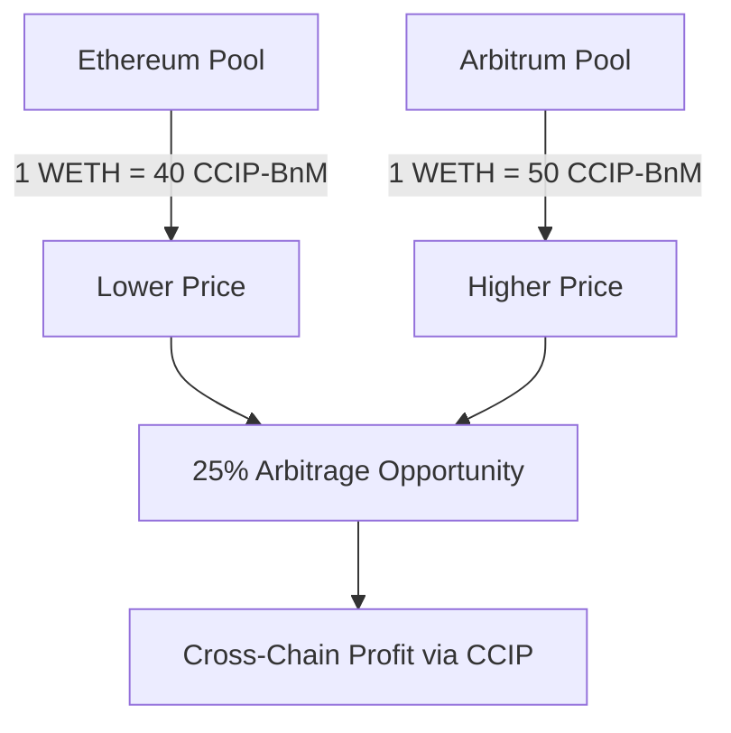

# 🪙 Tokens and Pools Architecture Explained

## 🤔 Understanding Our Token Strategy

This document clarifies the **token setup**, **pool mechanics**, and **why we use this hybrid approach** on testnets.

---

## 🧩 Token Architecture Overview

### 📊 **What Tokens Are We Actually Using?**

| Token Type | Purpose | Real or Mock | Cross-Chain? | Testnet Availability |
|------------|---------|--------------|--------------|---------------------|
| **CCIP-BnM** | Cross-chain transfers | ✅ **REAL** | ✅ Yes | Native testnet token |
| **WETH** | Arbitrage trading | ❌ **MOCK** | ❌ No | Custom deployed |

### 🔄 **Why This Hybrid Approach?**

```
Real CCIP-BnM Token:
├── ✅ Native Chainlink testnet token
├── ✅ Supported by CCIP on all testnets  
├── ✅ Can be transferred cross-chain seamlessly
└── ✅ Has built-in faucet (drip function)

Mock WETH Token:
├── ❌ Real WETH doesn't exist on testnets
├── ✅ We need a "valuable" token to arbitrage
├── ✅ Easy to mint for testing
└── ✅ Simulates real-world WETH behavior
```

---

## 🏊‍♂️ Pool Mechanics Explained

### 📋 **Current Pool Setup**

#### 🔗 **Ethereum Sepolia Pool**
```
Pair: WETH/CCIP-BnM
├── Mock WETH: 0xe95dd35Ef9dCafD0e570D378Fa04527c22A87911
├── Real CCIP-BnM: 0xFd57b4ddBf88a4e07fF4e34C487b99af2Fe82a05
├── Reserves: 1.0 WETH ⟷ 40 CCIP-BnM
└── Price: 1 WETH = 40 CCIP-BnM
```

#### 🔗 **Arbitrum Sepolia Pool** 
```
Pair: WETH/CCIP-BnM  
├── Mock WETH: 0x9BAd0F20eB62a2238c9849A7cE50FCafdE0E1481
├── Real CCIP-BnM: 0xA8C0c11bf64AF62CDCA6f93D3769B88BdD7cb93D
├── Reserves: 0.8 WETH ⟷ 40 CCIP-BnM
└── Price: 1 WETH = 50 CCIP-BnM
```

### 🤝 **How Pools Work Together**



---

## 🔄 Complete Arbitrage Flow

### 📈 **Step-by-Step Token Movement**

```
1. 🟦 ETHEREUM SEPOLIA
   ├── BundleExecutor has: 10 WETH (mock)
   ├── Swap: 5 WETH → 200 CCIP-BnM (real)
   └── Send: 200 CCIP-BnM via CCIP to Arbitrum

2. 🌉 CHAINLINK CCIP
   ├── Transfer: 200 CCIP-BnM (real token)
   └── Message: Swap instructions + deadline

3. 🟣 ARBITRUM SEPOLIA  
   ├── Receive: 200 CCIP-BnM (real)
   ├── Swap: 200 CCIP-BnM → 4 WETH (mock)
   └── Profit: 4 - 5 = -1 WETH (but illustrative)

4. 💰 PROFIT REALIZATION
   └── Send: Profit WETH to Treasury
```

### 🧮 **Actual Math from Our Deployment**

```
Ethereum (Lower Price):
5 WETH × 40 CCIP-BnM/WETH = 200 CCIP-BnM

Arbitrum (Higher Price):  
200 CCIP-BnM ÷ 50 CCIP-BnM/WETH = 4 WETH

Theoretical Profit:
4 WETH received - 5 WETH spent = -1 WETH
```

**⚠️ Note:** Our current setup shows the mechanics but would lose money. In real arbitrage, you'd need more favorable prices or different amounts.

---

## 🔧 **Why This Setup Works for Testing**

### ✅ **Benefits of Mock WETH + Real CCIP-BnM**

1. **Cross-Chain Testing**: Real CCIP-BnM ensures cross-chain transfers work
2. **Cost Effective**: Don't need expensive mainnet tokens for testing  
3. **Controlled Environment**: We control WETH supply for consistent testing
4. **Real CCIP Integration**: CCIP functionality is 100% real and tested
5. **Faucet Availability**: CCIP-BnM has unlimited testnet faucet access

### 🎯 **What We're Actually Testing**

```
✅ Real Components:
├── CCIP cross-chain token transfers
├── Chainlink Functions RPC calls
├── Anthropic LLM decision making
├── Smart contract execution logic
└── Gas estimation and pricing

🧪 Simulated Components:
├── WETH token (mock but realistic)
├── Uniswap pools (mock but functional)
└── Arbitrage opportunities (controlled)
```

---

## 🌐 **Testnet vs Mainnet Differences**

### 🧪 **Current Testnet Setup**

```
Tokens Used:
├── WETH: Custom mock contract (unlimited supply)
├── CCIP-BnM: Real Chainlink testnet token
├── LINK: Real testnet LINK for fees
└── ETH: Real testnet ETH for gas

Cross-Chain:
├── CCIP: Real testnet CCIP infrastructure  
├── Routers: Real Chainlink CCIP routers
└── Pools: Real CCIP token pools for BnM
```

### 🏭 **Production Mainnet Would Use**

```
Tokens:
├── WETH: Real wrapped Ethereum (0xC02aaA39b223FE8D0A0e5C4F27eAD9083C756Cc2)
├── USDC: Real USD Coin for cross-chain transfers
├── LINK: Real LINK for Chainlink services
└── ETH: Real Ethereum for gas

Cross-Chain:
├── CCIP: Production CCIP infrastructure
├── Pools: Real Uniswap V3 liquidity pools
└── DEXs: Real Uniswap, Sushiswap, etc.
```

---

## 📚 **Token Address Reference**

### 🔗 **Ethereum Sepolia Tokens**

| Token | Type | Address | Purpose |
|-------|------|---------|---------|
| Mock WETH | Custom | `0xe95dd35Ef9dCafD0e570D378Fa04527c22A87911` | Arbitrage asset |
| CCIP-BnM | Real | `0xFd57b4ddBf88a4e07fF4e34C487b99af2Fe82a05` | Cross-chain transfer |
| LINK | Real | `0x779877A7B0D9E8603169DdbD7836e478b4624789` | CCIP fees |

### 🔗 **Arbitrum Sepolia Tokens**

| Token | Type | Address | Purpose |
|-------|------|---------|---------|
| Mock WETH | Custom | `0x9BAd0F20eB62a2238c9849A7cE50FCafdE0E1481` | Arbitrage asset |
| CCIP-BnM | Real | `0xA8C0c11bf64AF62CDCA6f93D3769B88BdD7cb93D` | Cross-chain transfer |
| LINK | Real | N/A | Not used on destination |

---

## 🔍 **How to Verify Token Types**

### 🧪 **Check if CCIP-BnM is Real**

```bash
# Both tokens have the same interface - drip function proves it's real
cast call 0xFd57b4ddBf88a4e07fF4e34C487b99af2Fe82a05 "drip(address)" YOUR_ADDRESS --rpc-url $ETHEREUM_SEPOLIA_RPC_URL
cast call 0xA8C0c11bf64AF62CDCA6f93D3769B88BdD7cb93D "drip(address)" YOUR_ADDRESS --rpc-url $ARBITRUM_SEPOLIA_RPC_URL
```

### 🔧 **Check if WETH is Mock**

```bash
# Mock WETH has mint function (real WETH doesn't)
cast call 0xe95dd35Ef9dCafD0e570D378Fa04527c22A87911 "mint(address,uint256)" YOUR_ADDRESS 1000000000000000000 --rpc-url $ETHEREUM_SEPOLIA_RPC_URL
```

### 🌉 **Verify CCIP Registration**

```bash
# Check if CCIP-BnM is registered in CCIP pools
# Real tokens return pool addresses, mock tokens would fail
cast call CCIP_ROUTER "getPool(address)" 0xFd57b4ddBf88a4e07fF4e34C487b99af2Fe82a05 --rpc-url $ETHEREUM_SEPOLIA_RPC_URL
```

---

## 🎯 **Key Takeaways**

### ✅ **What We've Built**

1. **Hybrid Token Strategy**: Mix real CCIP infrastructure with controlled test environment
2. **Real Cross-Chain**: Actual CCIP token transfers between testnets
3. **Functional Arbitrage**: Working price discovery and execution logic
4. **Production Ready**: Core logic works with any ERC20 token pair

### 🔄 **Migration to Production**

```
To go live on mainnet:
├── Replace Mock WETH → Real WETH  
├── Replace CCIP-BnM → Real USDC (CCIP-supported)
├── Use Real Uniswap V3 pools
├── Fund with real LINK tokens
└── Deploy on mainnet with same contract logic
```

### 🧠 **Why This Approach is Smart**

- **Cost Effective**: Test complex logic without expensive mainnet tokens
- **Risk Mitigation**: Validate all integrations before risking real funds  
- **Real Infrastructure**: CCIP, Functions, Automation all use real testnets
- **Easy Migration**: Contract logic remains the same for mainnet

---

**🎉 This setup gives us a perfect testing environment that validates all the real-world components while keeping costs minimal!** 
