# 🛡️ SUAVE Integration Guide - Complete Beginner's Guide

## 📋 Table of Contents

1. [What is SUAVE?](#what-is-suave)
2. [Why We Need SUAVE](#why-we-need-suave)
3. [SUAVE Concepts](#suave-concepts)
4. [Setup & Prerequisites](#setup--prerequisites)
5. [Integration Steps](#integration-steps)
6. [Bundle Creation](#bundle-creation)
7. [Testing SUAVE](#testing-suave)
8. [Troubleshooting](#troubleshooting)
9. [Demo Integration](#demo-integration)

## What is SUAVE?

**SUAVE** (Single Unified Auction for Value Expression) is a **decentralized MEV (Maximal Extractable Value) protection system** built by Flashbots. Think of it as a "private mempool" that protects your transactions from frontrunning and MEV attacks.

### 🎯 Simple Explanation

Imagine you want to make a profitable trade, but you're worried that:
- **Frontrunners** will copy your trade and execute it first
- **MEV bots** will sandwich attack you
- **Your transaction fails** due to changing market conditions

SUAVE solves this by:
1. **Hiding your transaction** until it's ready to execute
2. **Bundling transactions together** atomically (all succeed or all fail)
3. **Protecting against MEV attacks** through privacy

## Why We Need SUAVE?

### 🚨 The Problem: MEV Attacks

Without SUAVE, our arbitrage bot faces these risks:

```
Your Arbitrage Transaction in Public Mempool:
1. 🔍 MEV Bot detects your profitable arbitrage
2. 🏃‍♂️ MEV Bot copies your strategy with higher gas
3. 💰 MEV Bot executes first and takes the profit
4. 😢 Your transaction fails or becomes unprofitable
```

### ✅ The Solution: SUAVE Protection

With SUAVE:

```
Your Arbitrage Bundle in SUAVE:
1. 🔒 Transaction details are hidden (encrypted)
2. 📦 Bundled with other transactions atomically  
3. 🛡️ Protected from frontrunning and MEV
4. ✅ Either all transactions succeed or all revert
```

## SUAVE Concepts

### Key Terms

| Term | Definition | Example |
|------|------------|---------|
| **Bundle** | Group of transactions that execute together | [Swap USDC→WETH, Bridge WETH, Swap WETH→USDC] |
| **Kettle** | SUAVE's execution environment | Like Ethereum's EVM but for bundles |
| **SUAPP** | SUAVE Application (like dApp) | Our arbitrage bundle builder |
| **Confidential Data** | Private transaction data | Hidden swap details |
| **Block Builder** | Entities that create blocks | Validators who include bundles |

### How SUAVE Works

```mermaid
graph TD
    A[Your Arbitrage Plan] --> B[Create Bundle]
    B --> C[Submit to SUAVE Kettle]
    C --> D[Bundle Auction]
    D --> E[Block Builder Selection]
    E --> F[Execute All or Revert All]
    F --> G[Profit Protected! 🎉]
```



## Setup & Prerequisites

### 1. Network Configuration

SUAVE has its own testnet called **Rigil**:

```bash
# SUAVE Rigil Testnet Details
Network Name: SUAVE Rigil
RPC URL: https://rpc.rigil.suave.flashbots.net
Chain ID: 16813125
Currency: ETH
Explorer: https://explorer.rigil.suave.flashbots.net
```

### 2. Get Testnet ETH

```bash
# Visit SUAVE faucet (if available) or ask in Discord
# You need small amounts of ETH for gas fees on SUAVE
```

### 3. Python Dependencies

```bash
# Install required packages
pip install web3 aiohttp requests asyncio

# For more advanced integration:
# pip install suave-sdk  # (if available)
```

### 4. Environment Setup

```bash
# Add to your .env file
SUAVE_RPC_URL=https://rpc.rigil.suave.flashbots.net
SUAVE_KETTLE_URL=https://kettle.rigil.suave.flashbots.net
SUAVE_PRIVATE_KEY=your_suave_private_key_here
```

## Integration Steps

### Step 1: Basic Connection Test

```python
# test_suave_connection.py
from web3 import Web3
import requests
import os

def test_suave_connection():
    # Test RPC connection
    w3 = Web3(Web3.HTTPProvider("https://rpc.rigil.suave.flashbots.net"))
    
    try:
        # Get latest block
        latest_block = w3.eth.block_number
        print(f"✅ SUAVE connection successful! Latest block: {latest_block}")
        
        # Test account balance
        if 'SUAVE_PRIVATE_KEY' in os.environ:
            account = w3.eth.account.from_key(os.environ['SUAVE_PRIVATE_KEY'])
            balance = w3.eth.get_balance(account.address)
            print(f"💰 Account balance: {w3.from_wei(balance, 'ether')} ETH")
        
        return True
    except Exception as e:
        print(f"❌ SUAVE connection failed: {e}")
        return False

if __name__ == "__main__":
    test_suave_connection()
```

### Step 2: Understand Bundle Structure

```python
# Example bundle structure for our arbitrage
example_bundle = {
    "version": "v0.1",
    "inclusion": {
        "block": "latest",           # Include in latest block
        "maxBlock": "latest+2"       # Or within next 2 blocks
    },
    "body": [
        {
            "tx": {
                "to": "0xBundleBuilderContract",
                "data": "0x...",         # Encoded function call
                "value": "0x0",
                "gasLimit": "0x7A120",   # 500,000 gas
                "gasPrice": "0x5F5E100"  # Gas price in wei
            },
            "canRevert": False           # Must succeed
        },
        {
            "tx": {
                "to": "0xCCIPContract",
                "data": "0x...",         # Cross-chain message
                "value": "0x0",
                "gasLimit": "0x61A80"    # 400,000 gas
            },
            "canRevert": False
        }
    ],
    "metadata": {
        "description": "Cross-chain arbitrage bundle",
        "strategy": "arbitrage",
        "expectedProfit": "100.0"
    }
}
```

## Bundle Creation

The `bundle_builder.py` file already contains the implementation for creating SUAVE bundles. Here's how to use it:

```python
from suave.bundle_builder import SUAVEBundleBuilder
import asyncio

async def create_demo_bundle():
    builder = SUAVEBundleBuilder()
    
    # Sample arbitrage plan
    plan = {
        'plan_id': 'DEMO_123',
        'timestamp': int(time.time()),
        'token': 'WETH',
        'buy_chain': 'arbitrum',
        'sell_chain': 'avalanche',
        'expected_profit': 100.0
    }
    
    bundle_id = await builder.create_arbitrage_bundle(plan)
    return bundle_id

# Run the demo
asyncio.run(create_demo_bundle())
```

## Testing SUAVE

### Local Testing Setup

```bash
# Test the SUAVE integration
cd suave
python bundle_builder.py

# Expected output:
# 🛡️ SUAVE Bundle Builder initialized
# 📡 Connected to: https://rpc.rigil.suave.flashbots.net
# 🧪 Testing SUAVE Integration...
# 🔨 Creating SUAVE bundle for plan: TEST_123456789
# ...
```

### Debug Connection Issues

```python
def debug_suave_connection():
    import requests
    
    # Test SUAVE RPC
    try:
        response = requests.get("https://rpc.rigil.suave.flashbots.net", timeout=10)
        print(f"SUAVE RPC Status: {response.status_code}")
    except Exception as e:
        print(f"Connection error: {e}")
        print("Possible solutions:")
        print("1. Check internet connection")
        print("2. Verify SUAVE testnet is operational")
        print("3. Try alternative RPC endpoints")
```

## Troubleshooting

### Common Issues

1. **Connection Failed**
   - Verify internet connection
   - Check if SUAVE testnet is operational
   - Try alternative RPC endpoints

2. **Bundle Rejected**
   - Check gas limits
   - Verify transaction encoding
   - Ensure transactions can succeed

3. **Bundle Not Included**
   - Gas price too low
   - Network congestion
   - Bundle expired

### Getting Help

- **SUAVE Documentation**: https://suave-alpha.flashbots.net/
- **Flashbots Discord**: Community support
- **GitHub Issues**: Report bugs and issues

## Demo Integration

For the hackathon demo, the SUAVE integration will:

1. **Show the Problem**: Without MEV protection, transactions are vulnerable
2. **Demonstrate SUAVE**: Bundle creation and submission process
3. **Highlight Benefits**: MEV protection and atomic execution
4. **Real-time Monitoring**: Bundle status and inclusion tracking

### Running the Demo

```bash
# Start the full demo
python suave/bundle_builder.py

# This will show:
# - SUAVE connection
# - Bundle creation
# - Submission process
# - Status monitoring
```

## Key Benefits for Our Hackathon

1. **🛡️ MEV Protection**: Protects arbitrage profits from frontrunning
2. **⚛️ Atomic Execution**: All transactions succeed or all fail
3. **🔒 Privacy**: Transaction details hidden until execution
4. **📊 Real-time Monitoring**: Track bundle status and inclusion
5. **🎯 Demo Ready**: Working integration for hackathon presentation

The SUAVE integration ensures our cross-chain arbitrage bot can execute profitable trades without being exploited by MEV bots! 🚀 